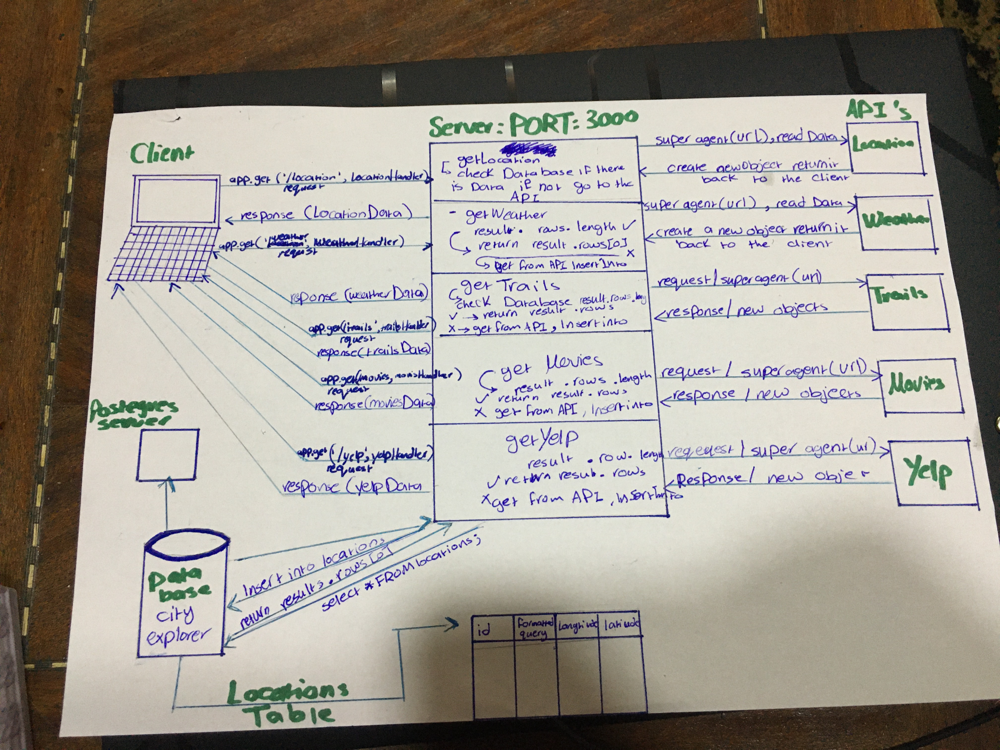

# LAB - 00

## Proof of life Server

### Author: Ahlam Al-efishat

### Links and Resources

- [submission PR](https://github.com/AhlamAlefishat-401-advanced-javascript/lab-00/pull/1)
- [travis](https://travis-ci.com/github/AhlamAlefishat-401-advanced-javascript/lab-00)

- [front-end application](https://ahlamlab-00.herokuapp.com/)
#### Documentation
- [jsdoc](https://ahlamlab-00.herokuapp.com/docs/)

### Modules
#### `pos.js`
##### Exported Values and Modules
###### `isAlive(dead) => boolean`
Return true/false to indicate how the server works

### Setup
#### `.env` requirements (where applicable)
- `PORT` - Port Number

#### Running the app 
- `npm start`
- Endpoint: `/`
  - Returns a boolean
- Endpoint: `/docs`
  - Returns JSDoc Documentation Pages
#### Tests
- Unit Tests: `npm test`
- Lint Tests: `npm run lint`

Incomplete Tests:

- Need to test xyz ...

#### UML
